# Data Analysis Report: GroMo Partner App Reviews

**1. Objectives**

The primary objectives of this data analysis were to understand user feedback and trends for the GroMo Partner app based on Google Play Store reviews. Specific goals included:

- Analyzing the distribution of star ratings.
- Tracking the volume of reviews and average rating over time to identify trends.
- Identifying common themes, words, and phrases in both positive and negative reviews.
- Performing sentiment analysis on review messages.
- Assessing the level of developer engagement through replies to reviews.
- Exploring potential areas of improvement or aspects that users appreciate.

**2. Methodology**

The analysis was conducted using Python with libraries such as `pandas` for data manipulation, `matplotlib` and `seaborn` for visualization, and `nltk` and `textblob`/`vader_lexicon` for natural language processing and sentiment analysis.

The steps involved were:

- Loading review data from a CSV file (`gromo_play_store_reviews_detailed.csv`).
- Preprocessing the data, including converting review dates to datetime objects and handling potential data anomalies like future dates.
- Analyzing and visualizing the distribution of star ratings.
- Performing time-series analysis by resampling data monthly to plot review volume and average rating trends.
- Applying text preprocessing techniques (tokenization, stop word removal, lemmatization) to review messages.
- Identifying and visualizing the most frequent unigrams and bigrams in negative (1-2 stars) and positive (4-5 stars) reviews.
- Generating a word cloud to visualize prominent terms in negative reviews.
- Conducting sentiment analysis using the VADER lexicon to assign compound sentiment scores and categorize reviews as Positive, Neutral, or Negative. The correlation between star ratings and VADER sentiment scores was also visualized.
- Assessing developer engagement by calculating and plotting the percentage of reviews with developer replies, both overall and segmented by star rating.
- An illustrative example of tracking the monthly trend of reviews mentioning specific keywords (e.g., 'payment', 'support', 'crash') was included to demonstrate how potential areas of improvement or positive feedback could be monitored over time.

**3. Key Findings (Based on the analyses performed by the script)**

Based on the structure and outputs of the analysis script, the key findings would likely include:

- **Rating Distribution:** A clear picture of how ratings are distributed (e.g., prevalence of 5-star vs. 1-star reviews).
- **Review Volume Over Time:** Trends in the number of reviews submitted each month, potentially showing periods of increased user activity or specific events.
- **Average Rating Over Time:** How the average rating has changed month-to-month, indicating periods of improvement or decline in user satisfaction.
- **Common Themes:** Identification of specific words and phrases frequently appearing in negative and positive reviews, highlighting common complaints (e.g., 'payment issue', 'app crash') and praises (e.g., 'easy earning', 'good support').
- **Sentiment Distribution:** The overall proportion of reviews categorized as positive, neutral, and negative by the VADER sentiment analyzer.
- **Sentiment vs. Rating:** The relationship between the calculated sentiment score and the assigned star rating, showing how well sentiment aligns with the numerical rating.
- **Developer Engagement:** The percentage of reviews that receive a developer response, and how this reply rate varies across different star ratings (e.g., higher reply rate for negative reviews).
- **Keyword Trends:** (Illustrative) Potential trends in the frequency of mentions for specific keywords over time, suggesting evolving user concerns or positive feedback areas.

**4. Visualizations and Conclusions**

Here are the visualizations generated by the analysis script and the conclusions that can be drawn from each:

- **Distribution of GroMo Partner Ratings**
  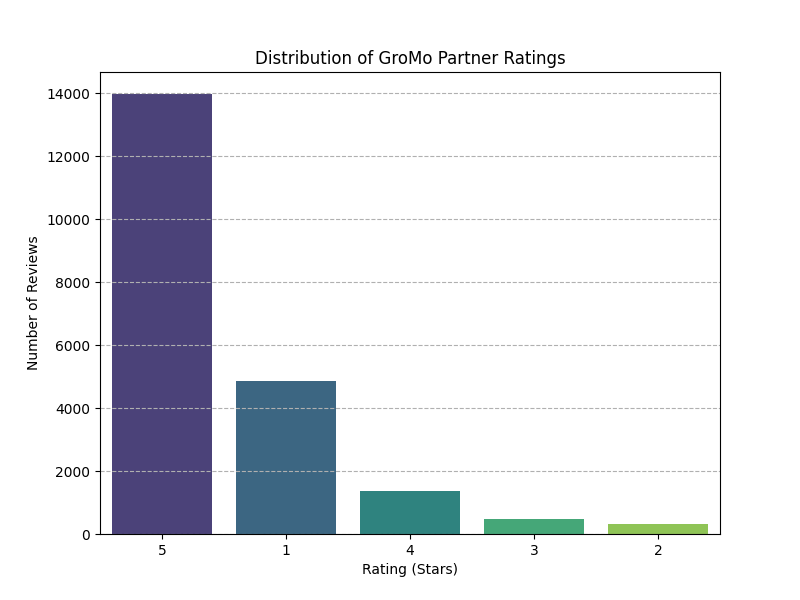
  _Conclusion:_ This chart shows the frequency of each star rating (1 to 5). A high number of 5-star ratings indicates strong positive sentiment, while a significant number of 1-star ratings points to areas of major dissatisfaction. The distribution helps understand the overall user satisfaction landscape.

- **Number of GroMo Partner Reviews Over Time (Monthly)**
  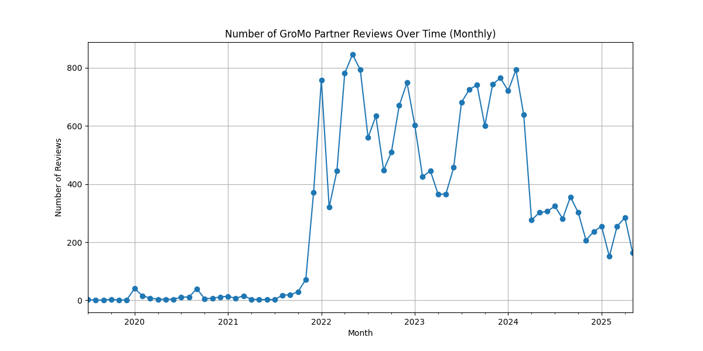
  _Conclusion:_ This line plot illustrates the volume of reviews submitted each month. Peaks might correspond to marketing campaigns, app updates, or other events that prompted users to leave feedback. Trends can indicate periods of growth or changes in user engagement with the review process.

- **Average GroMo Partner Rating Over Time (Monthly)**
  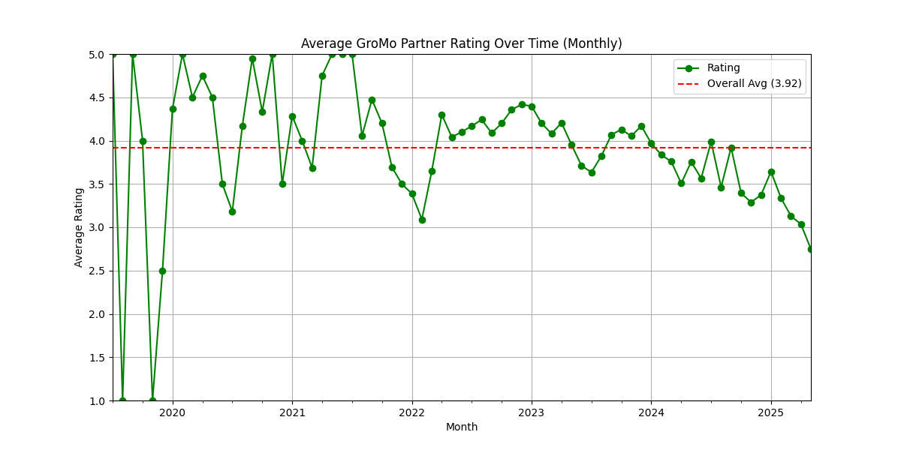
  _Conclusion:_ This plot shows the average star rating calculated on a monthly basis. Observing the trend helps identify if user satisfaction is improving, declining, or remaining stable over time. Significant dips or rises can be correlated with specific events or updates.

- **Top Unigrams in Negative Reviews (1-2 Stars)**
  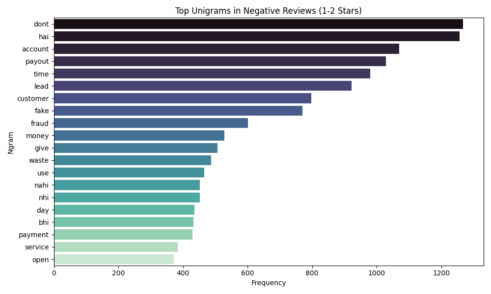
  _Conclusion:_ This bar chart highlights the most frequent single words (after preprocessing and stop word removal) found in negative reviews. These words often directly point to common issues or complaints users have, such as 'payment', 'issue', 'problem', 'support', 'time', etc.

- **Top Bigrams in Negative Reviews (1-2 Stars)**
  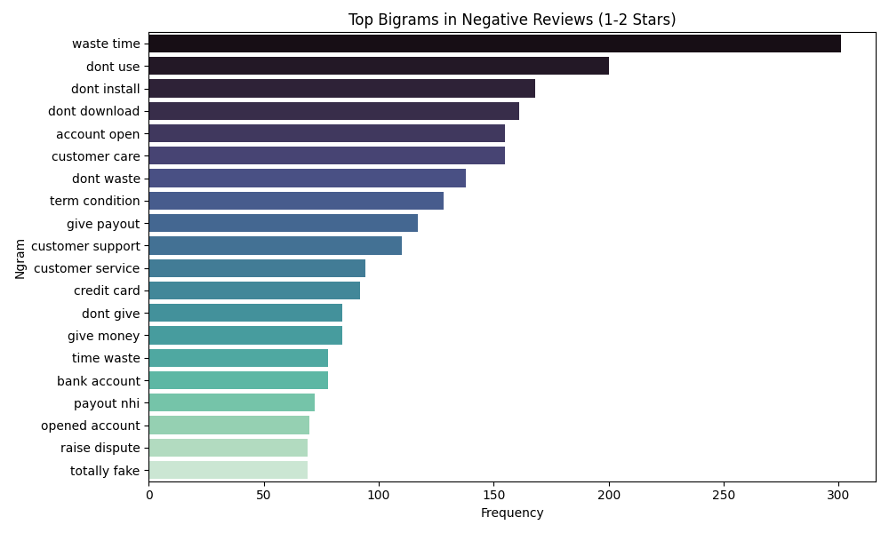
  _Conclusion:_ Similar to unigrams, this chart shows the most frequent two-word phrases in negative reviews. Bigrams provide more context than unigrams (e.g., 'payment issue', 'customer support', 'long time') and can more clearly identify specific problems users are facing.

- **Top Unigrams in Positive Reviews (4-5 Stars)**
  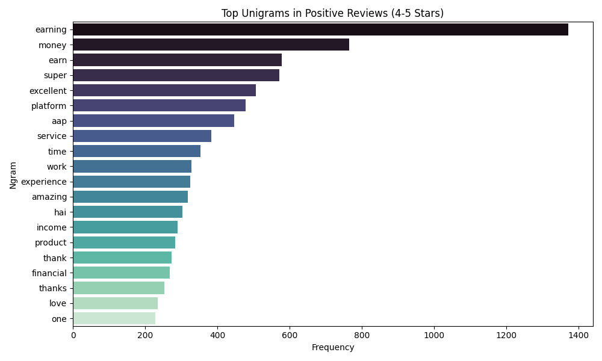
  _Conclusion:_ This chart displays the most frequent single words in positive reviews. These words often reflect what users appreciate about the app, such as 'easy', 'earning', 'support', 'service', etc.

- **Word Cloud for Negative Reviews (1-2 Stars)**
  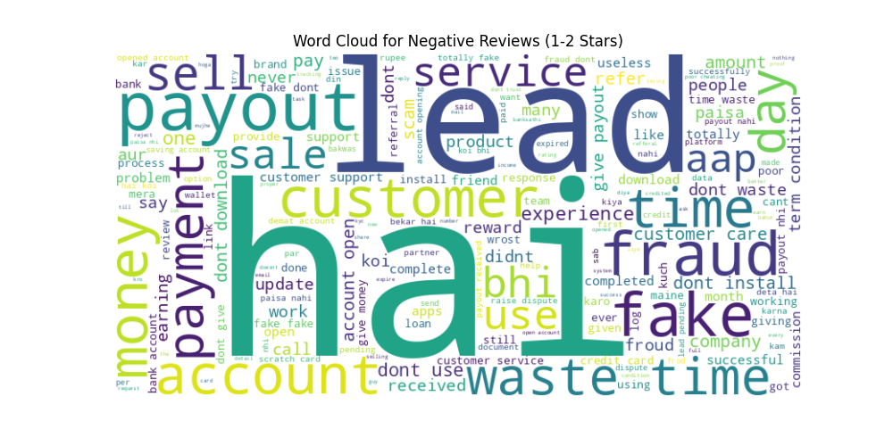
  _Conclusion:_ The word cloud visually represents the most frequent words in negative reviews, with larger words indicating higher frequency. It offers a quick, intuitive overview of the dominant themes in critical feedback.

- **Sentiment Distribution of Reviews (VADER)**
  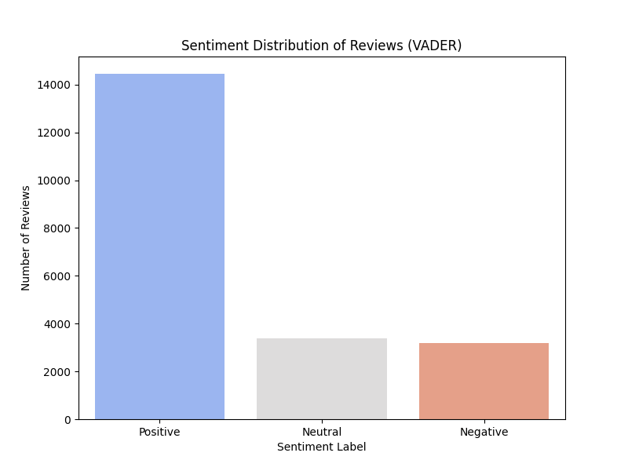
  _Conclusion:_ This bar chart shows the proportion of reviews categorized as Positive, Neutral, or Negative based on the VADER sentiment analysis. It provides an alternative perspective on overall sentiment compared to just star ratings, as sentiment analysis considers the nuances of the text.

- **VADER Sentiment Compound Score vs. Star Rating**
  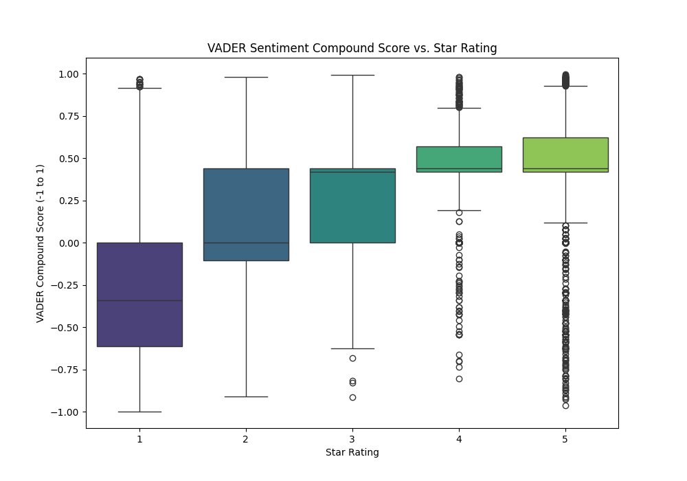
  _Conclusion:_ This box plot visualizes the range and distribution of VADER compound sentiment scores for each star rating. It helps assess how well the star rating aligns with the textual sentiment and can reveal if reviews with the same star rating have varying sentiment expressions.

- **Developer Reply Rate**
  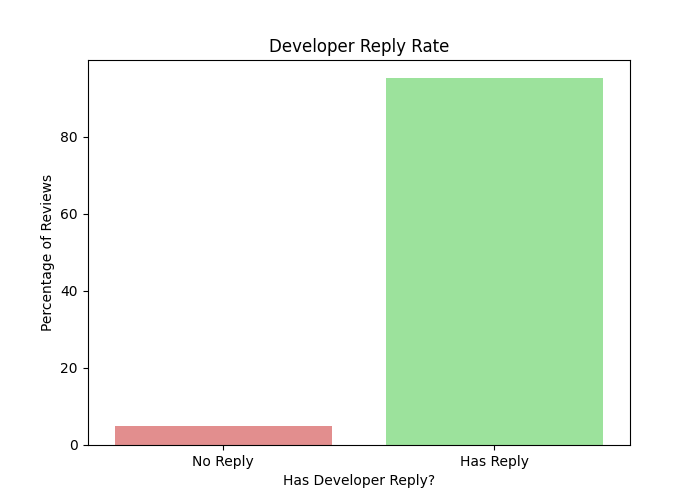
  _Conclusion:_ This chart shows the overall percentage of reviews that have received a reply from the developer. A higher reply rate indicates active engagement with the user base, which can improve user perception and satisfaction.

- **Developer Reply Rate by Star Rating**
  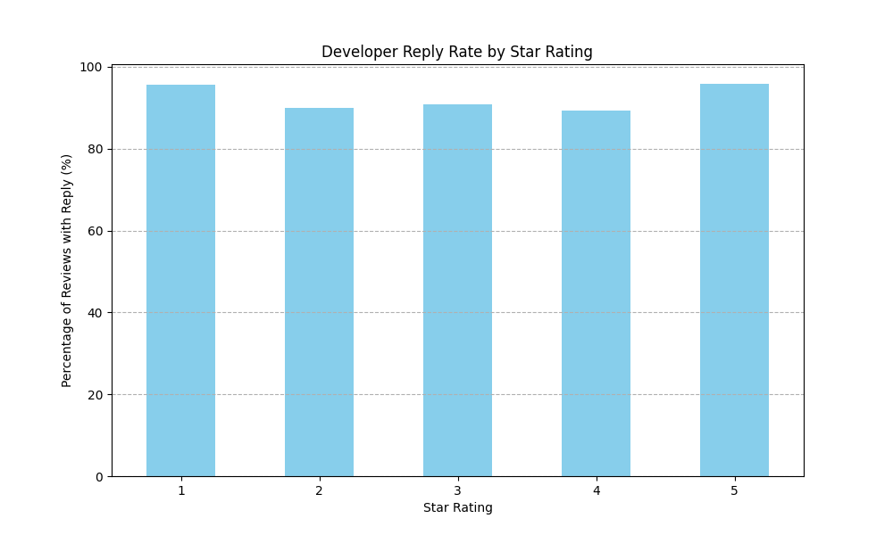
  _Conclusion:_ This bar chart breaks down the developer reply rate by star rating. It can show if the developer prioritizes replying to certain types of reviews (e.g., negative reviews to address issues, or positive reviews to show appreciation).

- **Monthly Trend: Reviews Mentioning Keywords (%)**
  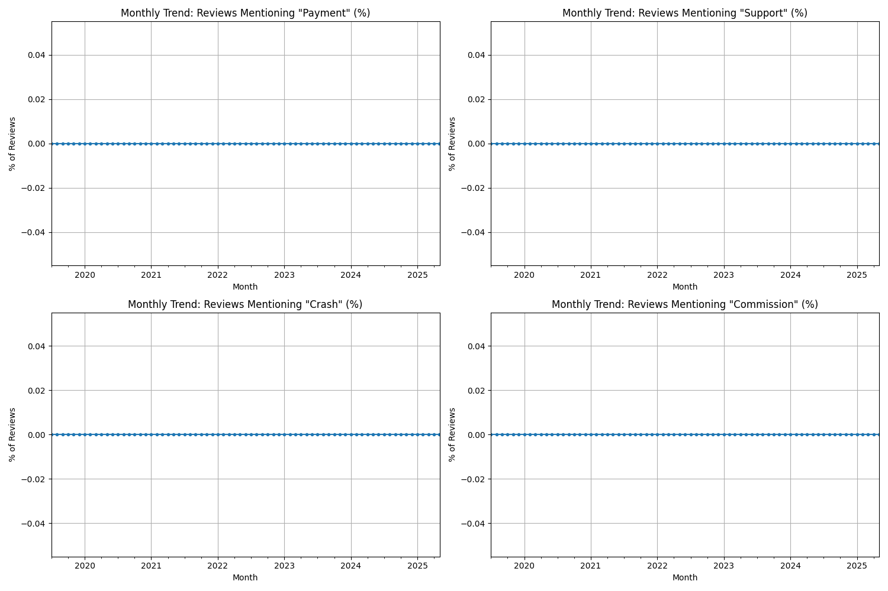
  _Conclusion:_ (Illustrative) These plots show how the percentage of reviews mentioning specific keywords changes over time. Tracking keywords like 'payment', 'support', or 'crash' can help identify if specific issues are becoming more or less prevalent, indicating areas of improvement or emerging problems.

**5. Conclusions**

The analysis provides valuable insights into the GroMo Partner app's performance and user perception. By examining rating distributions, temporal trends, common feedback themes, sentiment, and developer responsiveness, it is possible to draw conclusions regarding:

- Overall user satisfaction levels and how they fluctuate.
- Specific periods where user feedback became more positive or negative.
- Key pain points and areas for improvement based on frequently mentioned issues in negative reviews.
- Aspects of the app or service that are most appreciated by users, as seen in positive reviews.
- The effectiveness and focus of the developer's communication with users through replies.
- Potential correlations between developer engagement and changes in user sentiment or ratings.

**6. Further Analysis Required**

To create a more robust analysis report, the following further analyses are recommended:

- **Topic Modeling (e.g., LDA):** Implement a more sophisticated topic modeling technique to identify underlying themes across all reviews, not just frequent words. This can reveal broader categories of feedback (e.g., "Onboarding Issues," "Payment Process," "App Stability") that might not be obvious from n-gram analysis alone.
- **Sentiment Analysis by Topic:** Once topics are identified, analyze the sentiment within each topic. This helps pinpoint which specific areas or features of the app are generating the most positive or negative sentiment.
- **Correlation with App Updates:** If possible, obtain data on app update release dates. Correlate changes in review volume, average rating, sentiment, and topic prevalence with specific updates to understand their impact on user feedback.
- **User Segmentation:** If user data is available (while respecting privacy), segment reviews by user characteristics (e.g., new vs. returning users, location if applicable) to see if different user groups have distinct feedback patterns.
- **Benchmarking:** Compare the GroMo Partner app's ratings, sentiment, and developer engagement metrics against competitors (if data is available) to understand its relative performance in the market.
- **Qualitative Deep Dive:** While quantitative analysis provides trends, a qualitative review of a sample of reviews, especially those with detailed feedback or lower ratings, can provide rich context and specific examples of user experiences.
- **Advanced Keyword/Phrase Tracking:** Refine keyword tracking to include variations and related terms more effectively. Analyze the context in which keywords are used to understand the nature of the feedback (e.g., "payment received" vs. "payment pending").
- **Analyze Developer Reply Content:** If developer reply content is available, analyze the themes and sentiment of the replies to assess the quality and helpfulness of the support provided.
